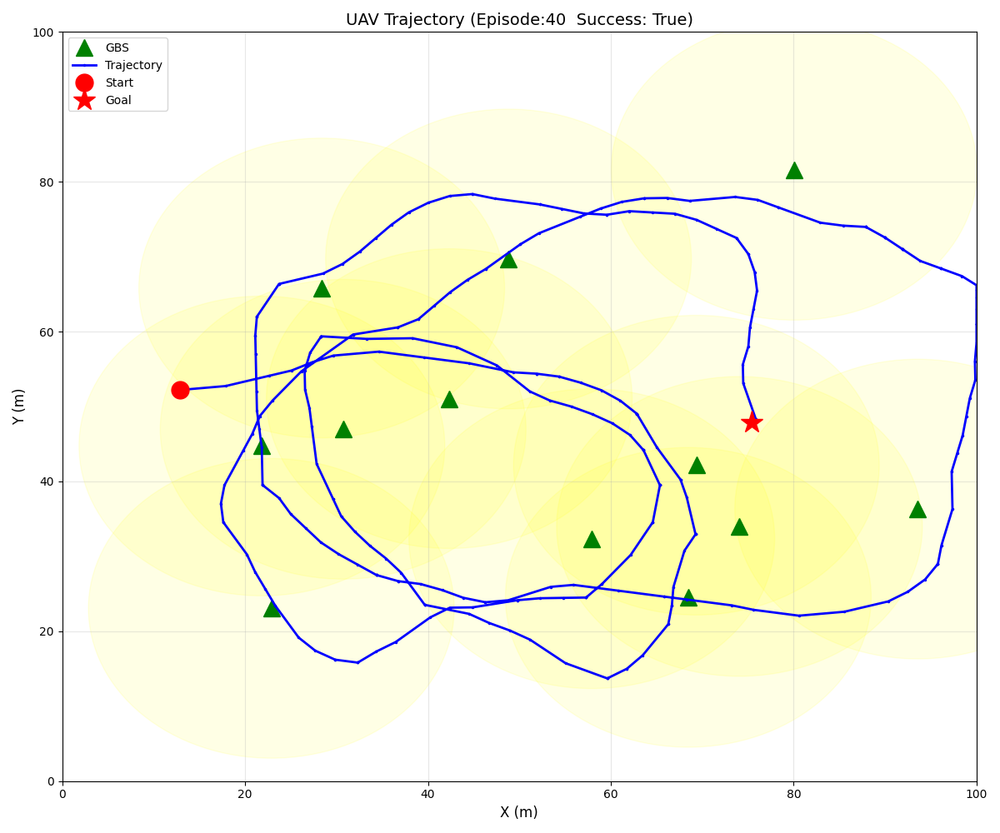
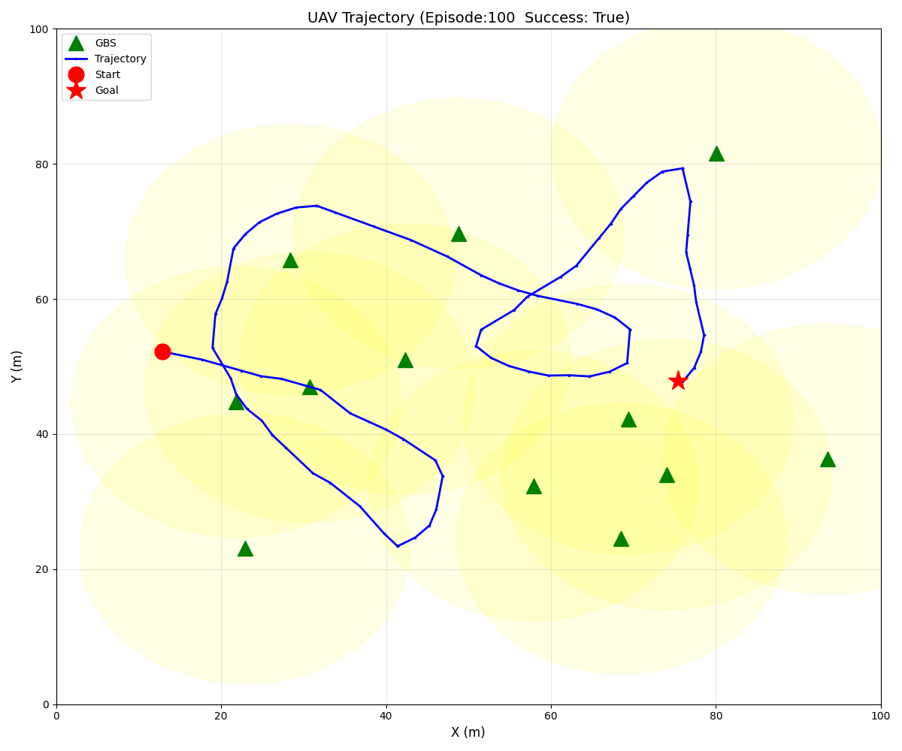
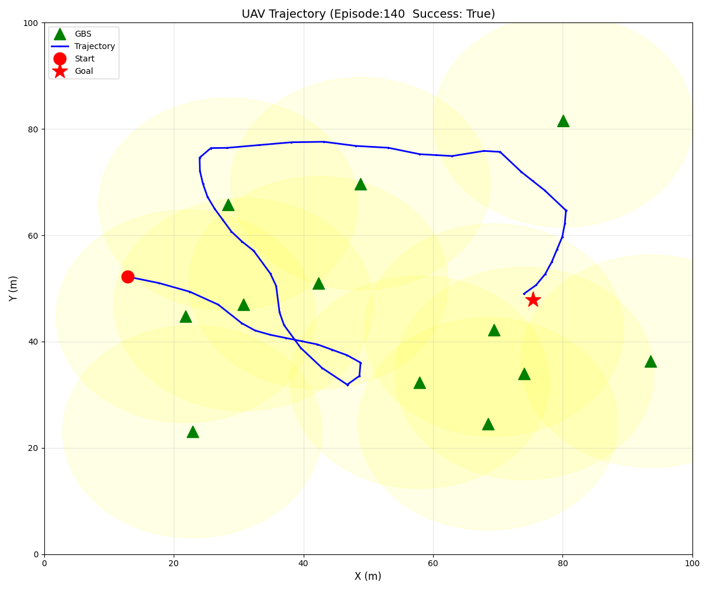
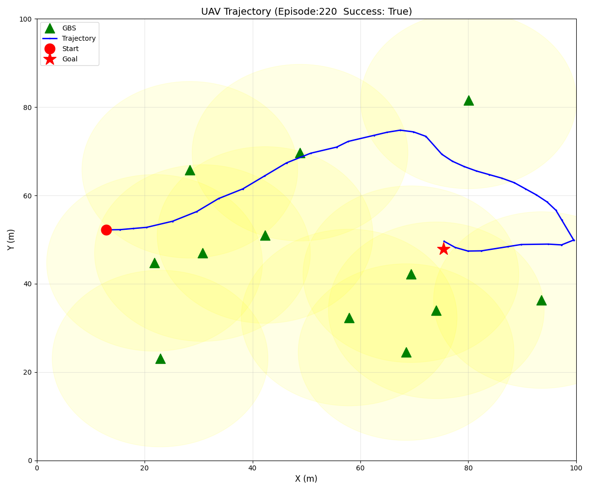
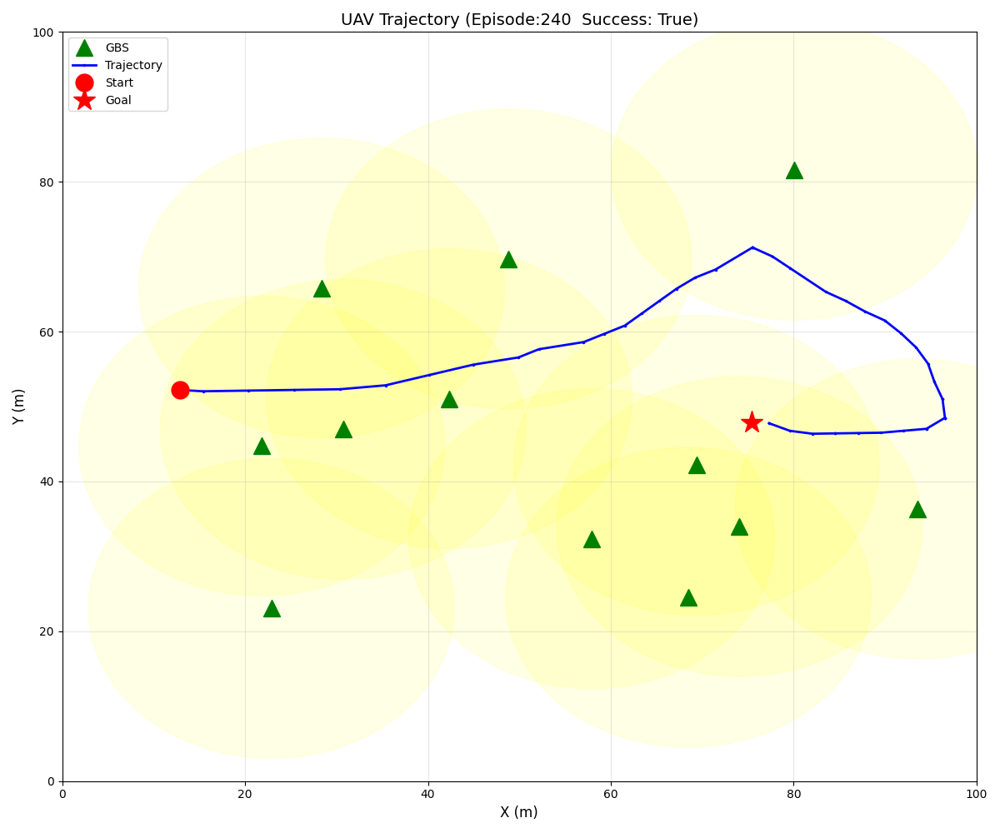
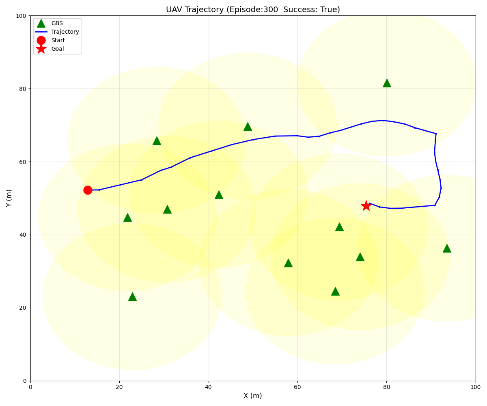
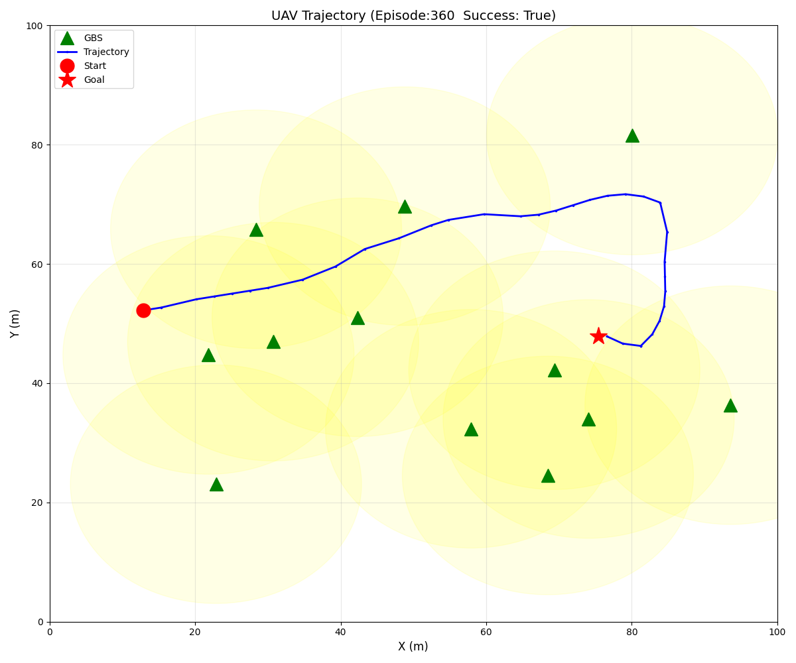
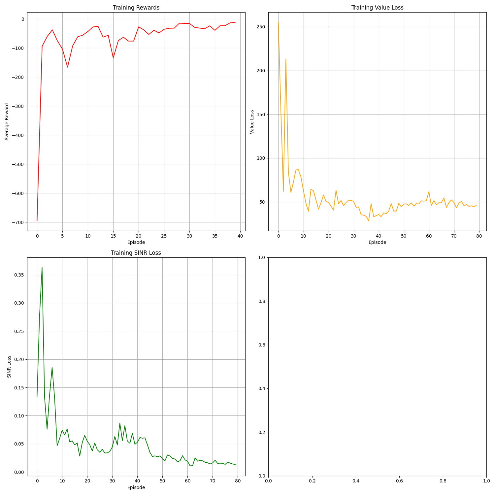

# 智能体轨迹优化项目

**原文：** [《Learning-Based UAV Trajectory Optimization With Collision Avoidance and Connectivity Constraints》](https://ieeexplore.ieee.org/document/9629361)

**轨迹图：**

    
    
    
    

**曲线图：**

    

